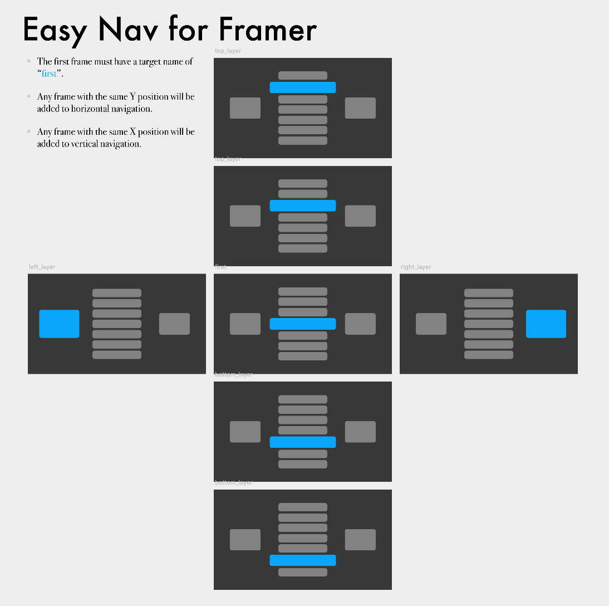

# EasyNav for Framer Studio

EasyNav is a Framer module that generates keyboard navigation based on the position of frames in the Design view of Framer.



To use EasyNav, just layout how you'd like the navigation to look in the Design view and EasyNav will work out the navigation logic for you. 

Any frames that share an exact x-position will navigate vertically. Any frames that share an exact y-position will navigate horizontally.

The best way to use it, is to download the easy-nav example in this repository and try it out.

## The Starting Layer
To define the frame you'd like to start on, simply set a target for your starting frame called `first`.

## Jumping to a New Frame
To jump to a frame, simply use EasyNav's `setCurrent` method. If EasyNav is defined as `e`, then we can do: –

`e.setCurrent( nextFrame )`

## Overrides
With EasyNav, you can override the behaviour on any layer by using a simple convention.

If you have a targeted frame called `myLayer` you can use any of the following overrides: –
```
myLayer.okEvent = ->
    print "Ok!"

myLayer.backEvent = ->
    print "Back!"

myLayer.upEvent = ->
    print "Take me up!"

myLayer.downEvent = ->
    print "Take me down!"

myLayer.rightEvent = ->
    print "Take me right!"

myLayer.leftEvent = ->
    print "Take me left!"
```

If you'd like to know more or you have any particular feature requests, get in touch – [@struanfraser](http://twitter.com/struanfraser).

## Other useful projects for TV
* [Keyboard Input for Framer](https://github.com/Skinny-Malinky/Keyboard-Input-for-Framer) 
* [FocusEngine](https://github.com/bpxl-labs/FocusEngine)
* [RemoteLayer](https://github.com/bpxl-labs/RemoteLayer)